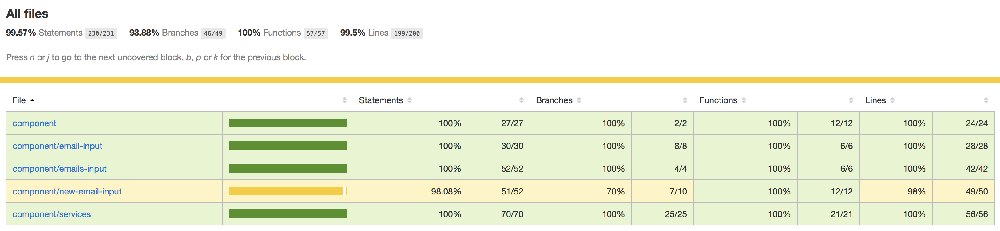

# email-inputs
Lightweight emails input component without third party dependencies

[](https://circleci.com/gh/acierto/email-inputs)

## How component works

* Email block creates by pressing Enter, entering comma, or by losing focus on the
  input field. A Block can be deleted.
* Input width depends on the parent container’s width and height. If parent width changes,
  emails redistributed by rows.
* Input neither depends on the form or page styles, nor conflicts with them.
* If the input has too many emails, the user can scroll it.
* Pasted emails converted into blocks immediately. If multiple comma-separated
  emails pasted (e.g., “ ivan@mail.ru , max@mail.ru ”), they are converted into multiple
  blocks.
* "Add email" button adds a random email to the list.
* "Get emails count" button shows an alert with valid emails count.
* Editing of added emails is impossible.
* It is possible to create several emails editors on the same page.
* "emails-input" has no external dependencies like React, Lodash or any polyfills.
* "emails-input" has no memory leaks or doesn't re-render all email blocks every time you add or remove a single email.

## How component looks

 

## Browsers support

| [](http://godban.github.io/browsers-support-badges/)</br>IE / Edge | [](http://godban.github.io/browsers-support-badges/)</br>Firefox | [](http://godban.github.io/browsers-support-badges/)</br>Chrome | [](http://godban.github.io/browsers-support-badges/)</br>Safari |
| --------- | --------- | --------- | --------- |
| IE11, Edge| last version| last version| last version|

## Playground

You can find a link to a playground [here](https://acierto.github.io/email-inputs/).
There is already some data pre-generated for testing some corner cases.

You will find there 4 different cases to play with.

### Case 1. 

Clean component in the form, no extra configuration provided.

### Case 2.

Component contains already some of pre-generated emails and gives already some picture how it looks in live without
any actions required by the user.

### Case 3.

There are several things configured:
* More than 1000 emails to check how it looks and works on a relatively large set.
* Used a long email name to show that this case is handled.
* Placeholder for the input field is custom, namely `add more emails...`
* Titles on emails are enabled. So long (and therefore trimmed) email names will be visible on hover.
* Also 4 custom validators configured. Email is valid if all next is true (on top of default email validator):
** Email can't have 'v' letter.
** Email characters should be less than 20
** Emails can't be duplicated
** Emails can't be more than 6.

### Case 4.

There are 2 email inputs located on the same form, so that you can see that it's possible to play with multiple
components on the same page. Form buttons will give results twice in the order how emails inputs are located on the
form.

[How it is configured in details](#enlightening-how-playground-configured)

## API 

|Name|Description|
|----|-----------|
|getAllEmails|A method to get all entered emails. Both valid and invalid.|
|replaceAll|A method to replace all entered emails with new ones.|
|subscribe|Ability to subscribe for emails list changes.|

## Options

|Name|Type|Default|Description|
|----|----|----|--------|
|placeholder|string|add more people...|The text displayed in the input field to give a hint about what the field is about.|
|showTitle|boolean|false|If true shows the title for each email. Can be useful if email is too long.|
|validators|array of functions|[]|You can add your custom validators which will be applied on top of already existing validation of email syntax. The format of the validator is `(email, allEmails) => !(/\d/).test(email)` - this example will eliminate the usage of digits in the email. If the validator's function returns `true` it means that the email is valid.|

## Examples of component usages in the code

### Declaring the component

```html
<!-- form header -->
<div id="emails-input"></div>
<!-- form footer, buttons -->
<script src="emails-input.js"></script>
<script>
var inputContainerNode = document.querySelector('#emails-input');
var emailsInput = EmailInputs(inputContainerNode);
// Handling Add email and Get emails count buttons, etc.
</script>
```

First we have to define the element to which we will assign emails input. In this example it is `<div id="emails-input"></div>`.
Next we have to add the script to the html page. One of the ways to do it is `<script src="emails-input.js"></script>`,
otherwise if you use Webpack, you can also just import it in your code as `import EmailsInput from 'emails-input'; '`.

```javascript
var inputContainerNode = document.querySelector('#emails-input');
var emailsInput = EmailsInput(inputContainerNode);
```
With these lines emails input initialized and assigned to a defined place by us.
 
```javascript
var inputContainerNode = document.querySelector('#emails-input');
var options = {};
var emailsInput = EmailsInput(inputContainerNode, options);
``` 
It's also possible with a second argument to provide custom options to a component. [List of options](#options)

```javascript
var inputContainerNode = document.querySelector('#emails-input');
var options = {
    placeholder: 'type a new email',
    showTitle: true,
    validators: [
        (email) => email.length > 10,
        (email) => !(/[A-Z]/).test(email),
    ]
};
var emailsInput = EmailsInput(inputContainerNode, options);
``` 

Emails input will have custom placeholder, titles will be shown on hover and extra validators will be applied on 
already added emails. First one will check that email has at least 10 characters, second validator will invalidate 
all emails where used at least 1 capital letter. 

Up so far we know already how to include the component, and the ways to configure it.
Let's see how it's possible to interact with the component via API:

```javascript
var emailsInput = EmailsInput(inputContainerNode, options);
emailsInput.getAllEmails();
```
Invoking this method will return the array of all emails with the following structure:
```javascript
[{
     email: 'john@miro.com',
     id: '1',
     valid: true
 },{
     email: 'john',
     id: '2',
     valid: false
 }]
```
Based on this structure you can see which email is valid or not and remove one of emails by `id`. `id` is required here due 
to possible email duplications. It is intentionally not validated in this case as it might be necessary in some business cases. 

So then there's no way to make duplicate emails as invalid? Not really! Actually you can. For that and not only for that the second
parameter in the validator has access to already all added emails. Creating next validator will achieve it:

```javascript
(email, allEmails) => allEmails.indexOf(email) === -1
``` 

Actually by having an information of currently adding email name and access to all emails you as a user have very 
flexible way how you are really willing to use and enhance it.

The next evolvement in validators could be:
* adding a reason, so that the user knows where and why it happened.
* dynamically added/removed validators. It might be useful in complicated wizard pages 

# For contributors

## Requirements to the system
There are 2 options, to execute all commands with [Gradle](https://gradle.org/) or [Gulp 4](https://gulpjs.com/).
* For the first option you have to install on your computer JDK. Verified on [JDK 1.8](https://www.oracle.com/java/technologies/javase-jdk8-downloads.html).
* For the second option you have to install locally [Node.js](https://nodejs.org/en/), verified on 14.2.0 and [Yarn](https://yarnpkg.com/)
verified on version 1.22.4

First version of running commands is less intrusive for the system as it won't require changing locally installed versions 
of Node.js, Gulp and Yarn. Even install them if something hasn't been installed yet.

## How to run the project
You can run the application with the next command:

For Linux/MacOS `./gradlew gulpDefault` or `gulp`

For Windows  `gradlew.bat gulpDefault`

The project will be accessible via [http://localhost:3000/](http://localhost:3000/).

## How to run tests

Here are 2 types of tests - unit tests and integration tests.

### Unit tests
To run only unit tests you can use this command:
`./gradlew gulpUnitTests` or `gulp jest`.

Results of the tests run and coverage can be found in `<project-dir>/build/reports/coverage/index.html`
You will see it in a nicely displayed table.


If in some cases your coverage drops, IDE doesn't always show properly where is the issue, like for example in
Intellij IDEA. In that case you can use that report for navigation and troubleshooting. 

Example of that:

 
 

As you can see from above screenshots. With yellow cells report shows on overview page where the coverage has not 
reached. When you drill down to the issue, you can see the exact line with the issue. In this case it's like 9, as one of 
the cases has not covered. 

### Integration tests

To run only integration tests you can use this command:
`./gradlew gulpIntegrationTests` or `gulp clean && gulp build-development && gulp e2e`.

Integration tests implemented with help of [Protractor](https://www.protractortest.org/). As Protractor based on 
[Selenium](https://www.selenium.dev/) it's possible to run integration tests on variety of browsers and at the same 
time leverage the use of [Selenium Grid](https://www.selenium.dev/documentation/en/grid/) and run tests in parallel
what in the long run will help to speed up the growing amount of tests.

Due to the not ideal work of Selenium and Protractor I've been using 
[Protractor Base DSL](https://www.npmjs.com/package/protractor-base-dsl). That library tackles well-known 
issues with Protractor and browser drivers and on top of that provides a concise syntax to execute commands to Selenium.

In case of some failures, you can find screenshots in `<project-dir>/build/e2e`.

### All tests

To run all tests you can use this command:
`./gradlew gulpTests` or `gulp clean && gulp build-development && gulp selenium-install && gulp e2e && gulp jest`.

Every commit triggers the build on [CircleCI](https://circleci.com/) and runs this command. Configuration for that  
can be found in `<project-dir>/.circleci/config.yml`. The status badge is added to README.md and located on the top of the 
file to track that new commits don't bring regressions. 

## How to update GitHub Pages

To update GitHub Pages you have to run this command:
`./gradlew gulpGhPages` or `gulp gh-pages`. 

## How styles configured

As a base model used [Less](http://lesscss.org/) with combination of [CSS Modules](https://github.com/css-modules/css-modules).
Less gives an opportunity to create clean, hierarchical and reusable structures of styles.
CSS Modules helps to achieve the isolation of components by avoiding style clashes in the rest of the page.
The smooth integration provided by Webpack, and requires only `css-loader` configuration. 

```javascript
{
    loader: 'css-loader',
    options: {
        importLoaders: 1,
        localsConvention: 'camelCase',
        modules: {
            localIdentName: '[name]__[local]',
            mode: 'local'
        }
    }
}
```

Once CSS Modules is active, the existing tests will stop working as CSS class names will have different names. To make 
names less chaotic for e2e tests, the hash was excluded and used this pattern `[name]__[local]` which very similar 
to [BEM naming](http://getbem.com/introduction/).

To make unit tests on [Jest] happy, it requires to have `jest-css-modules` added and configured in "package.json" "jest" 
section. Module is very simple and depends on `identity-obj-proxy`. In essence, in the unit test when Jest see imports
of styles, it resolves it to the object with hierarchical structure of classNames. What makes it possible to use in tests
 `querySelector` to check the rendered html.

### Enlightening how Playground configured

Check `playground-data.js` file, you can play with providing other inputs or even new cases.
`playground.js` has an entry point for the playground.

You can find also in the code 2 versions of playground: `playground-demo` and `playground-development`. 
The reason behind that is to split the fast development and demonstrate how it works on the released version.

`playground-demo` includes dependency to emails-input in html page

```html
<!doctype html>
<html lang="en">
<head>
    <meta http-equiv="Content-Type" content="text/html; charset=utf-8"/>
    <title>Emails Input Playground Demo</title>
</head>
<body>
<div id="root"></div>
<script src="./emails-input.js"></script>
<script src="playground-demo.js"></script></body>
</html>
```

And in the code only in `playground-form.js` EmailsInput is created. You will not find any import there. Because this 
component is added to a global scope by the script in html.

What does `playground-development` to emulate the same and work with up-to-date code changes, is doing this in 
`playground-development.js`

```javascript
import {EmailsInput} from '../../component/emails-input/emails-input';
global.EmailsInput = EmailsInput;
```

In that way both cases actually work with emails-input component in isolation and communicate with it only through 
provided api calls. What can be found in `playground-form.js`. A short snippet of the code from there:

```javascript
    const registerListeners = (emailsInput) => {
        rootElement.querySelector(`.${styles.playgroundForm} .add-email`)
            .addEventListener('click', addEmailListener(emailsInput));
        rootElement.querySelector(`.${styles.playgroundForm} .get-emails-count`)
            .addEventListener('click', getEmailsCountListener(emailsInput));
    };

    const postRender = () => {
        options.emailsInputList.forEach((emailsInputConfig) => {
            const {id, placeholder, showTitle, validators} = emailsInputConfig;
            const inputContainerNode = document.querySelector(`#${id}`);
            const emailsInput = EmailsInput(inputContainerNode, {placeholder, showTitle, validators});
            emailsInput.replaceAll(emailsInputConfig.initialData);
            registerListeners(emailsInput);
        });
    };
```
